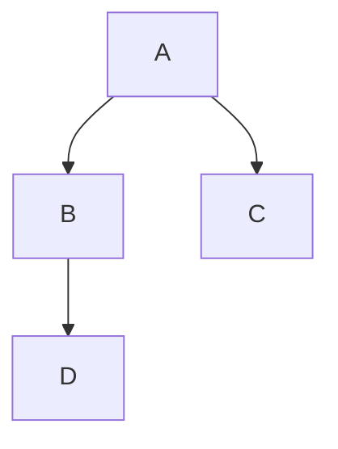
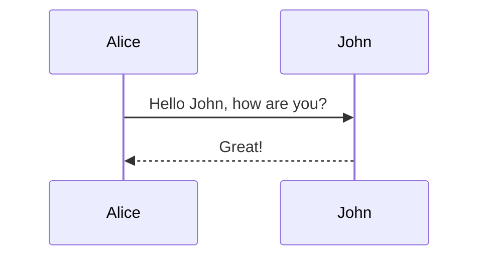
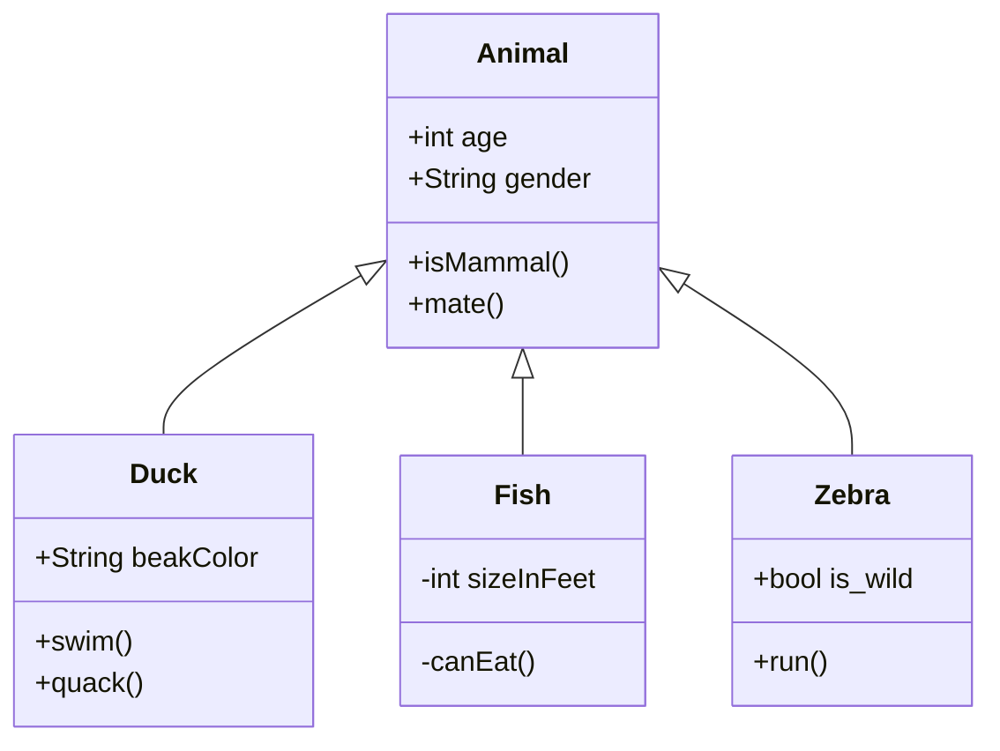
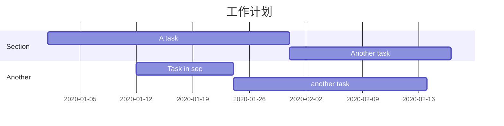
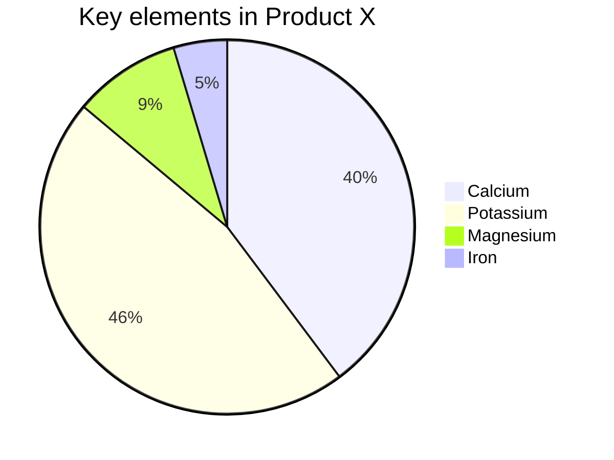

# mermaid


[toc]


### 流程图

语法解释：`graph` 关键字就是声明一张流程图，`TD` 表示的是方向，这里的含义是 Top-Down 由上至下。

```stylus
graph TD;
    A-->B;
    A-->C;
    B-->D;
```



### 时序图 

语法解释：`->>` 代表实线箭头，`-->>` 则代表虚线。

```stylus
sequenceDiagram
    Alice->>John: Hello John, how are you?
    John-->>Alice: Great!
```



### 状态图

语法解释：`[*]` 表示开始或者结束，如果在箭头右边则表示结束。

```stylus
stateDiagram
    [*] --> s1
    s1 --> [*]
```


### 类图

语法解释：`<|--` 表示继承，`+` 表示 `public`，`-` 表示 `private`，学过 Java 或者软件工程的同学应该都了解。

```stylus
classDiagram
      Animal <|-- Duck
      Animal <|-- Fish
      Animal <|-- Zebra
      Animal : +int age
      Animal : +String gender
      Animal: +isMammal()
      Animal: +mate()
      class Duck{
          +String beakColor
          +swim()
          +quack()
      }
      class Fish{
          -int sizeInFeet
          -canEat()
      }
      class Zebra{
          +bool is_wild
          +run()
      }
```



### 甘特图 

甘特图一般用来表示项目的计划排期，目前在工作中经常会用到。

语法也非常简单，从上到下依次是图片标题、日期格式、项目、项目细分的任务。

```stylus
gantt
    title 工作计划
    dateFormat  YYYY-MM-DD
    section Section
    A task           :a1, 2020-01-01, 30d
    Another task     :after a1  , 20d
    section Another
    Task in sec      :2020-01-12  , 12d
    another task      : 24d
```



### 饼图

饼图使用 `pie` 表示，标题下面分别是区域名称及其百分比。

```stylus
pie
    title Key elements in Product X
    "Calcium" : 42.96
    "Potassium" : 50.05
    "Magnesium" : 10.01
    "Iron" :  5
```




### 导出 

绘制好的图片可以选择菜单 / 文件 / 导出，导出为图片或者网页格式。在网页中图片是以 SVG 格式渲染的，你可以复制 SVG 内容，导入到 SVG 的图片编辑器中进一步操作。


###  小结

可以看到，Mermaid 使用非常简洁优雅的语法，让使用者可以快速的画出常用的图形，并且图片的非常美观，配色和谐，富有现代感。


